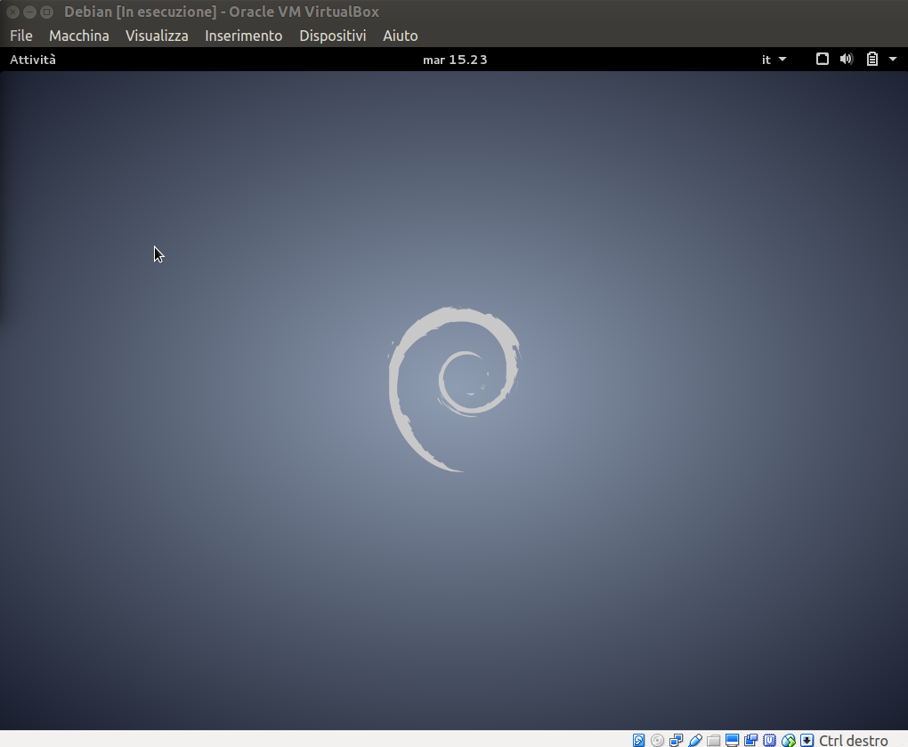
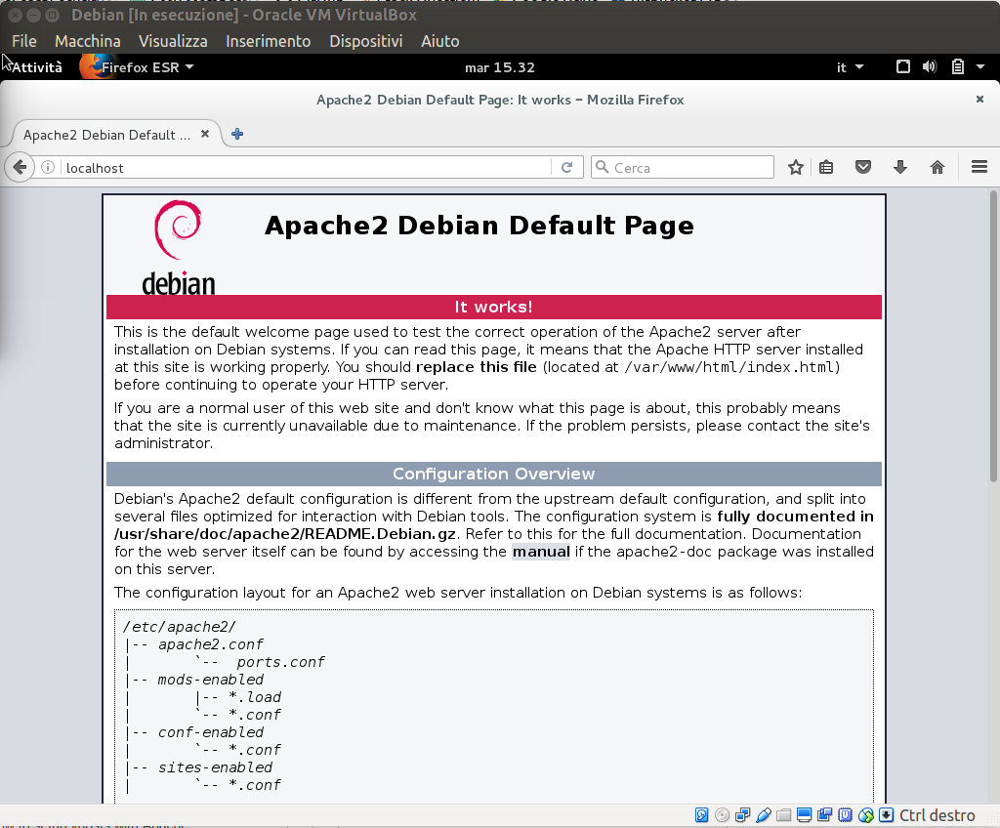

#PentesterLab Bootcamp
##1 - Linux and scripting
I'm not going too deep with this section since it's quite easy, I choose Debian as OS and Python as a scripting language (since I have a lot of experience with it) 

 

Really beautifoul!

##2 - HTTP
I easly installed apache on my system using:
~~~
sudo apt-get install apache2
~~~
...and let's see how the default Apache page looks like:

 

The next task involes changing the host file in order to access my local machine using the name *vulnerable*.

The host file is located at:
~~~
/etc/hosts
~~~
I just added this line in order to make it work:
~~~
sudo nano /etc/hosts
127.0.0.1 vulnerable
~~~

I used an easy python script to retreive the apache default page:
~~~python
import requests
r = requests.get("http://vulnerable")
print r.text
~~~

Using sockets:
~~~python
import socket
s = socket.socket(socket.AF_INET, socket.SOCK_STREAM)
s.connect(("vulnerable",80))
s.send("GET / HTTP/1.0\r\n\r\n")
while True:
	resp = s.recv(1024)
	if resp == '':
		break
	print resp
s.close()
~~~

I'm skipping the Burp part since I do it every single day at work :) 

## 3 - PHP and DNS martedì, 09. maggio 2017 04:21 

####Virtual hosting
I'm going to write e few lines on virtual hosting because I have no prior experience with it and it may be useful in the future.
Basically virtual hosting is a technology that allows to have multiple domain names on a single physical server (and of course treat them differently)
This may be useful for shared hosting, since is't less expensive tham the dedicated couterpart.
There are two *principal* kind of virtual hosting:

- **Name based**: Different domain names point to the same IP.
When the client makes a requests it must use the *Host* header, so the webserver acts accordingly.
One of the biggest problem of using Name Based virtual hosting is the use of **SSL**.
The problem exists because the webserver must know which certificate present to the client **before** data are sent, **but** the only thing that discriminate two virtual hosted site is the *Host* header wich is part of the data!

- **IP Based**: Different names point to different IPs, but they all belong to the physical server (es multiple network interfaces)

Both type of virtual hosting have pro and cons, and they can be combined together.

####PHP Basics
The task is to create a php page that echoes the GET parameter, I used htmlspecialchars() function to avoid XSS (spoiler :) )
~~~php
<?php
echo "Hello: " . htmlspecialchars($_GET['name']);
?>
~~~

The second task was to build a DB using MySQL and retreive some information using PHP.
For the DB I used the following code ( I admint I had to read again some documentation on SQL)
~~~SQL
CREATE DATABASE test;
USE test;
CREATE TABLE articolo(id int, descrizione VARCHAR(200));
INSERT INTO articolo VALUES (0, "A great book");
INSERT INTO articolo VALUES (1, "A great movie");
~~~
The PHP code I used to accomplish the task is the following:
~~~PHP
<?php
$servername = "localhost";
$username = "root";
$password = "";
$dbname = "test";

// Create connection
$conn = new mysqli($servername, $username, $password, $dbname);
// Check connection
if ($conn->connect_error) {
    die("Connection failed: " . $conn->connect_error);
} 

$sql = "SELECT * FROM articolo WHERE id=" .  $_GET['id'] . " LIMIT 1" ;
$result = $conn->query($sql);

if ($result->num_rows > 0) {
    // output data of each row
    while($row = $result->fetch_assoc()) {
        echo $row['descrizione'];
    }
} else {
    echo "0 results";
}
$conn->close();
?>
~~~
####DNS and WHOIS
The task is quite easy, find every info about PentesterLab using dig, nslookup and whois, let's begin.
~~~bash
nslookup pentesterlab.com
Server:		127.0.1.1
Address:	127.0.1.1#53

Non-authoritative answer:
Name:	pentesterlab.com
Address: 54.172.242.130
~~~
As we can see, the domain pentesterlab.com points to 54.172.242.130, let's proceed with some more detailed informations like MX and NS servers:
~~~bash
$ dig mx pentesterlab.com

; <<>> DiG 9.10.3-P4-Ubuntu <<>> mx pentesterlab.com
;; global options: +cmd
;; Got answer:
;; ->>HEADER<<- opcode: QUERY, status: NOERROR, id: 60950
;; flags: qr rd ra; QUERY: 1, ANSWER: 7, AUTHORITY: 0, ADDITIONAL: 1

;; OPT PSEUDOSECTION:
; EDNS: version: 0, flags:; udp: 1280
;; QUESTION SECTION:
;pentesterlab.com.		IN	MX

;; ANSWER SECTION:
pentesterlab.com.	28800	IN	MX	5 ASPMX5.GOOGLEMAIL.COM.
pentesterlab.com.	28800	IN	MX	5 ASPMX4.GOOGLEMAIL.COM.
pentesterlab.com.	28800	IN	MX	5 ASPMX3.GOOGLEMAIL.COM.
pentesterlab.com.	28800	IN	MX	3 ALT1.ASPMX.L.GOOGLE.COM.
pentesterlab.com.	28800	IN	MX	1 ASPMX.L.GOOGLE.COM.
pentesterlab.com.	28800	IN	MX	5 ASPMX2.GOOGLEMAIL.COM.
pentesterlab.com.	28800	IN	MX	3 ALT2.ASPMX.L.GOOGLE.COM.

;; Query time: 64 msec
;; SERVER: 127.0.1.1#53(127.0.1.1)
;; WHEN: Wed May 10 20:02:51 CEST 2017
;; MSG SIZE  rcvd: 224
~~~
~~~bash
$ dig ns pentesterlab.com

; <<>> DiG 9.10.3-P4-Ubuntu <<>> ns pentesterlab.com
;; global options: +cmd
;; Got answer:
;; ->>HEADER<<- opcode: QUERY, status: NOERROR, id: 43236
;; flags: qr rd ra; QUERY: 1, ANSWER: 3, AUTHORITY: 0, ADDITIONAL: 1

;; OPT PSEUDOSECTION:
; EDNS: version: 0, flags:; udp: 1280
;; QUESTION SECTION:
;pentesterlab.com.		IN	NS

;; ANSWER SECTION:
pentesterlab.com.	10565	IN	NS	a.dns.gandi.net.
pentesterlab.com.	10565	IN	NS	c.dns.gandi.net.
pentesterlab.com.	10565	IN	NS	b.dns.gandi.net.

;; Query time: 39 msec
;; SERVER: 127.0.1.1#53(127.0.1.1)
;; WHEN: Wed May 10 20:04:56 CEST 2017
;; MSG SIZE  rcvd: 106
~~~
Shall we try zone transfer on the NS servers?

~~~bash
$ for ns in $(host -t ns pentesterlab.com | cut -d " " -f4); do dig @$ns axfr pentesterlab.com; done

; <<>> DiG 9.10.3-P4-Ubuntu <<>> @c.dns.gandi.net. axfr pentesterlab.com
; (2 servers found)
;; global options: +cmd
; Transfer failed.

; <<>> DiG 9.10.3-P4-Ubuntu <<>> @b.dns.gandi.net. axfr pentesterlab.com
; (2 servers found)
;; global options: +cmd
; Transfer failed.

; <<>> DiG 9.10.3-P4-Ubuntu <<>> @a.dns.gandi.net. axfr pentesterlab.com
; (2 servers found)
;; global options: +cmd
; Transfer failed.

~~~
Well, it was worth a try.
